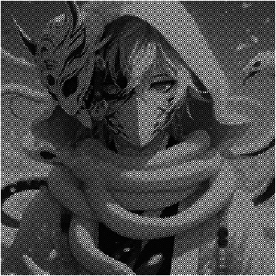
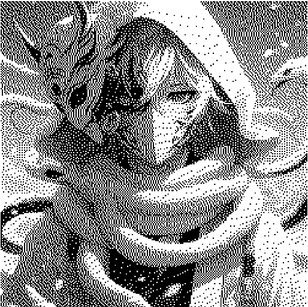

<b>
LAPORAN 
HALFTONING, PATTERNING DAN DITHERING
</b>

  

<b>
Dosen Pengampu :
Dr. Harja Santanapurba, M.Kom/ Novan Alkaf B.S.S.Kom.,
</b>

<b>
Disusun Oleh :
Muhammad Syahid (2310131210008)
</b>

<b>
PROGRAM STUDI PENDIDIKAN KOMPUTER
FAKULTAS KEGURUAN DAN ILMU PENDIDIKAN
UNIVERSITAS LAMBUNG MANGKURAT
2024
</b>

## 
KATA PENGANTAR

&nbsp;&nbsp;&nbsp;&nbsp;Puji syukur penulis panjatkan kepada Tuhan Yang Maha Esa, karena atas berkat dan rahmat-Nya, penulis dapat menyelesaikan laporan ini dengan baik. Laporan ini disusun sebagai bagian dari tugas mata kuliah Pemrosesan Citra Digital, dengan fokus pada teknik halftoning yang mencakup patterning dan dithering.

&nbsp;&nbsp;&nbsp;&nbsp;Penulis berharap laporan ini dapat memberikan wawasan yang lebih dalam mengenai teknik halftoning, serta penerapannya dalam pemrosesan citra digital. Selain itu, penulis juga ingin mengucapkan terima kasih kepada dosen dan rekan-rekan mahasiswa yang telah memberikan dukungan dan masukan yang berharga selama penyusunan laporan ini.

&nbsp;&nbsp;&nbsp;&nbsp;Semoga laporan ini dapat bermanfaat bagi pembaca dan menjadi referensi yang berguna dalam studi lebih lanjut tentang pemrosesan citra digital.

Banjarmasin, 18 Maret 2024 
 
 
Penulis,

## 
DAFTAR ISI

[TOC]

## 
BAB I   PENDAHULUAN

&nbsp;&nbsp;&nbsp;&nbsp;Dalam era digital saat ini, pemrosesan citra telah menjadi salah satu aspek penting dalam berbagai bidang, seperti seni, fotografi, dan komunikasi visual. Salah satu teknik yang banyak digunakan dalam pemrosesan citra adalah halftoning. Halftoning adalah metode yang memungkinkan representasi gambar dengan keterbatasan warna atau tinta, terutama dalam pencetakan. Teknik ini menciptakan ilusi dari berbagai nuansa grayscale melalui pola titik, yang memberikan efek visual yang halus dan menarik.

&nbsp;&nbsp;&nbsp;&nbsp;Penggunaan halftoning sangat relevan, terutama dalam konteks pencetakan, di mana keterbatasan jumlah warna tinta dapat menjadi tantangan. Melalui teknik halftoning, gambar dapat disajikan secara efektif dengan menggunakan kombinasi titik-titik kecil dalam ukuran dan kepadatan yang berbeda untuk menciptakan berbagai tingkat keabuan. Metode ini tidak hanya meningkatkan kualitas gambar tetapi juga mengurangi penggunaan tinta, yang berdampak positif pada efisiensi biaya.

&nbsp;&nbsp;&nbsp;&nbsp;Laporan ini bertujuan untuk menjelaskan secara mendalam mengenai teknik halftoning, dengan fokus pada dua metode utama: patterning dan dithering. Selain itu, laporan ini akan membahas langkah-langkah yang diambil dalam setiap metode, serta contoh penerapannya dalam pemrosesan citra digital. Diharapkan, pembaca dapat memperoleh pemahaman yang lebih baik tentang halftoning dan penerapannya dalam bidang pemrosesan citra.

## 
1.1  Latar Belakang Masalah

&nbsp;&nbsp;&nbsp;&nbsp;Dalam dunia digital yang semakin berkembang, pengolahan citra telah menjadi salah satu disiplin ilmu yang penting, terutama dalam bidang seni, komunikasi, dan informasi. Penggunaan gambar dalam format digital telah mengubah cara kita berinteraksi dengan informasi visual. Namun, representasi gambar dalam format digital sering kali mengalami keterbatasan, terutama ketika berkaitan dengan pencetakan. Keterbatasan ini dapat disebabkan oleh terbatasnya jumlah warna tinta yang tersedia dan kemampuan perangkat pencetak untuk menghasilkan variasi warna yang halus.

&nbsp;&nbsp;&nbsp;&nbsp;Halftoning muncul sebagai solusi untuk masalah ini, memungkinkan representasi gambar dengan nuansa warna yang lebih kaya, meskipun menggunakan hanya sejumlah warna tinta yang terbatas. Teknik halftoning menciptakan ilusi dari berbagai tingkat keabuan atau warna melalui pola titik yang berbeda ukuran dan kepadatannya. Dengan menggunakan teknik ini, gambar dapat dicetak dengan kualitas yang lebih baik, menghasilkan efek visual yang memikat.

&nbsp;&nbsp;&nbsp;&nbsp;Namun, pemahaman yang mendalam tentang metode halftoning, seperti patterning dan dithering, serta cara implementasinya dalam pemrosesan citra digital masih perlu diperhatikan. Banyak mahasiswa yang belum sepenuhnya memahami konsep dasar halftoning dan aplikasinya dalam situasi praktis. Oleh karena itu, penting untuk mempelajari dan mengkaji teknik halftoning agar dapat digunakan secara efektif dalam berbagai aplikasi digital.

&nbsp;&nbsp;&nbsp;&nbsp;Latar belakang inilah yang mendorong penulis untuk menyusun laporan ini, yang bertujuan untuk menguraikan dan menjelaskan teknik halftoning secara mendalam. Dengan memahami halftoning, diharapkan mahasiswa dapat mengatasi tantangan dalam pemrosesan citra dan meningkatkan kualitas hasil cetak gambar yang dihasilkan.

## 
1.2  Rumusan Masalah

1. 
&nbsp;&nbsp;&nbsp;&nbsp;Bagaimana metode halftoning, khususnya patterning dan dithering, dapat diterapkan untuk menghasilkan gambar grayscale yang berkualitas dengan keterbatasan warna atau tinta?

2. 
&nbsp;&nbsp;&nbsp;&nbsp;Apa saja langkah-langkah yang diperlukan dalam masing-masing metode halftoning untuk mencapai hasil yang optimal?

3. 
&nbsp;&nbsp;&nbsp;&nbsp;Apa saja kelebihan dan kekurangan dari masing-masing metode halftoning dalam konteks aplikasi praktis dan hasil visual yang dihasilkan?

4. 
&nbsp;&nbsp;&nbsp;&nbsp;Bagaimana algoritma yang digunakan dalam metode halftoning dapat mempengaruhi hasil akhir gambar yang dihasilkan?

## 
1.3  TUJUAN

1. 
&nbsp;&nbsp;&nbsp;&nbsp;Mahasiswa dapat memahami konsep dasar halftoning, termasuk metode patterning dan dithering.

2. 
&nbsp;&nbsp;&nbsp;&nbsp;Mahasiswa mampu mengidentifikasi dan membandingkan kelebihan dan kekurangan dari masing-masing metode halftoning dalam konteks pemrosesan citra.

3. 
&nbsp;&nbsp;&nbsp;&nbsp;Mahasiswa dapat melakukan langkah-langkah implementasi teknik halftoning untuk menghasilkan gambar grayscale yang berkualitas.

4. 
&nbsp;&nbsp;&nbsp;&nbsp;Mahasiswa dapat menggunakan algoritma halftoning yang tepat untuk mencapai hasil visual yang diinginkan dalam pemrosesan citra.

5. 
&nbsp;&nbsp;&nbsp;&nbsp;Mahasiswa dapat membuat file Markdown yang menyusun laporan dengan struktur yang jelas dan informatif.

## 
BAB II  METODE HALFTONING

&nbsp;&nbsp;&nbsp;&nbsp;Dalam laporan ini, kita akan membahas dua metode halftoning yang umum digunakan, yaitu Patterning dan Dithering. Kedua metode ini memiliki pendekatan yang berbeda untuk merepresentasikan gambar grayscale, tetapi keduanya bertujuan untuk menciptakan ilusi nuansa dengan keterbatasan warna tinta atau kemampuan perangkat pencetak.

### 
2.1. Patterning

&nbsp;&nbsp;&nbsp;&nbsp;Patterning adalah metode halftoning yang menggunakan pola titik untuk merepresentasikan berbagai tingkat keabuan. Dalam metode ini, area gambar dibagi menjadi blok-blok kecil, dan setiap blok diwarnai sesuai dengan tingkat keabuan yang diinginkan. Berikut adalah langkah-langkah dalam menerapkan metode patterning:

#### 
Langkah-langkah

1. 
&nbsp;&nbsp;&nbsp;&nbsp;Pembagian Skala Keabuan : Misalkan kita memiliki 6 tangga keabuan. Kita dapat membagi skala 0-255 menjadi 6 interval:

   - 
&nbsp;&nbsp;&nbsp;&nbsp;&nbsp;&nbsp;&nbsp;&nbsp;Interval:

     - 
&nbsp;&nbsp;&nbsp;&nbsp;&nbsp;&nbsp;&nbsp;&nbsp;0-42: Tangga 0

     - 
&nbsp;&nbsp;&nbsp;&nbsp;&nbsp;&nbsp;&nbsp;&nbsp;43-85: Tangga 1

     - 
&nbsp;&nbsp;&nbsp;&nbsp;&nbsp;&nbsp;&nbsp;&nbsp;86-128: Tangga 2

     - 
&nbsp;&nbsp;&nbsp;&nbsp;&nbsp;&nbsp;&nbsp;&nbsp;129-171: Tangga 3

     - 
&nbsp;&nbsp;&nbsp;&nbsp;&nbsp;&nbsp;&nbsp;&nbsp;172-213: Tangga 4

     - 
&nbsp;&nbsp;&nbsp;&nbsp;&nbsp;&nbsp;&nbsp;&nbsp;214-255: Tangga 5

2. 
&nbsp;&nbsp;&nbsp;&nbsp;Penerapan Blok: Gambar dibagi menjadi blok 2x2 pixel, dan setiap blok diberi nilai berdasarkan rata-rata keabuan pixel di dalam blok.

3. 
&nbsp;&nbsp;&nbsp;&nbsp;Pewarnaan Blok: Setiap blok diwarnai sesuai dengan tangga keabuan yang sesuai.

#### 
Contoh

&nbsp;&nbsp;&nbsp;&nbsp;Misalkan kita memiliki gambar dengan nilai grayscale sebagai berikut:

&nbsp;&nbsp;&nbsp;&nbsp;| Pixel 1 | Pixel 2 | Pixel 3 | Pixel 4 | 
&nbsp;&nbsp;&nbsp;&nbsp;|---------|---------|---------|---------| 
&nbsp;&nbsp;&nbsp;&nbsp;|   50    |   70    |   120   |   200   | 

&nbsp;&nbsp;&nbsp;&nbsp;Berikut adalah kode Octave untuk menerapkan metode patterning:

<b>
Kode :
</b>

image = imread('oni2.png'); 

if size(image, 3) == 3
  grayscale_image = rgb2gray(image);
else
  grayscale_image = image;
end

pattern_size = 2;

pattern = [
  0 1;
  1 0
]; 

[rows, cols] = size(grayscale_image);
pattern_image = zeros(rows, cols);

for i = 1:rows
  for j = 1:cols
    intensity = grayscale_image(i, j);

    pattern_image(i, j) = pattern(mod(i-1, pattern_size)+1, mod(j-1, pattern_size)+1) * intensity;
  end
end

 [0, 1]
pattern_image = mat2gray(pattern_image) * 255;
pattern_image = uint8(pattern_image);  % Konversi ke uint8

imshow(pattern_image);

<b>
Output :
</b>

  

### 
2.2. Dithering

&nbsp;&nbsp;&nbsp;&nbsp;Dithering adalah metode yang menciptakan ilusi nuansa dengan mengubah warna pixel berdasarkan nilai rata-rata warna di sekitarnya. Metode ini sangat berguna dalam konteks di mana kedalaman warna terbatas, seperti pada pencetakan atau tampilan grafis yang hanya dapat menampilkan sejumlah warna tertentu. Dithering sering kali digunakan untuk mengatasi masalah kedalaman warna yang rendah dengan menciptakan pola yang mengindikasikan warna yang lebih kompleks. Berikut adalah langkah-langkah dalam menerapkan metode dithering:

#### 
Langkah-langkah

1. 
&nbsp;&nbsp;&nbsp;&nbsp;Pemilihan Pixel : Tentukan pixel yang akan diubah warnanya berdasarkan nilai grayscale-nya.

2. 
&nbsp;&nbsp;&nbsp;&nbsp;Evaluasi Lingkungan : Hitung rata-rata nilai pixel di sekitarnya dan bandingkan dengan nilai target yang diinginkan.

3. 
&nbsp;&nbsp;&nbsp;&nbsp;Pengubahan Warna : Jika nilai pixel lebih besar dari rata-rata, ubah warnanya menjadi hitam; jika tidak, ubah warnanya menjadi putih.

#### 
Contoh

&nbsp;&nbsp;&nbsp;&nbsp;Misalkan kita memiliki citra grayscale dengan beberapa nilai pixel, dan kita ingin menerapkan dithering pada pixel tertentu. Berikut adalah kode Octave untuk menerapkan metode dithering:

<b>
octave
</b>
gambar = imread('oni2.png'); 

if size(gambar, 3) == 3
  gambar_grayscale = rgb2gray(gambar);
else
  gambar_grayscale = gambar;
end

gambar_dithering = double(gambar_grayscale);

[baris, kolom] = size(gambar_dithering);

for i = 1:baris
  for j = 1:kolom
    piksel_lama = gambar_dithering(i, j);
    piksel_baru = round(piksel_lama / 255) * 255;
    gambar_dithering(i, j) = piksel_baru;
    
    error = piksel_lama - piksel_baru;
    
    if j+1 <= kolom
      gambar_dithering(i, j+1) = gambar_dithering(i, j+1) + error * 7/16;
    end
    if i+1 <= baris && j-1 >= 1
      gambar_dithering(i+1, j-1) = gambar_dithering(i+1, j-1) + error * 3/16;
    end
    if i+1 <= baris
      gambar_dithering(i+1, j) = gambar_dithering(i+1, j) + error * 5/16;
    end
    if i+1 <= baris && j+1 <= kolom
      gambar_dithering(i+1, j+1) = gambar_dithering(i+1, j+1) + error * 1/16;
    end
  end
end

gambar_dithering = uint8(gambar_dithering);

imshow(gambar_dithering);

<b>
Output :
</b>

  

## 
BAB III  PENUTUP

### 
3.1. Kesimpulan 

&nbsp;&nbsp;&nbsp;&nbsp;Dalam laporan ini, telah dibahas dua metode halftoning, yaitu Patterning dan Dithering, yang merupakan teknik penting dalam pemrosesan citra digital. 

&nbsp;&nbsp;&nbsp;&nbsp;Metode Patterning menggunakan pola titik untuk merepresentasikan tingkat keabuan dengan membagi gambar menjadi blok-blok kecil dan mengisi setiap blok berdasarkan rata-rata nilai grayscale. Hal ini memungkinkan representasi visual yang lebih baik pada media pencetakan dengan keterbatasan warna.

&nbsp;&nbsp;&nbsp;&nbsp;Di sisi lain, Dithering mengatasi masalah kedalaman warna yang terbatas dengan menciptakan ilusi nuansa melalui pemilihan warna berdasarkan nilai ambang. Metode ini mampu meningkatkan tampilan gambar meskipun hanya menggunakan dua warna, yaitu hitam dan putih, dengan cara yang efektif.

&nbsp;&nbsp;&nbsp;&nbsp;Kedua metode ini memiliki kelebihan dan kekurangan masing-masing, dan pemilihan metode yang tepat tergantung pada konteks aplikasi serta kebutuhan spesifik dari proyek pemrosesan citra. Melalui implementasi kode Octave yang disertakan, diharapkan pembaca dapat lebih memahami penerapan teknik-teknik ini dan menerapkannya dalam proyek-proyek mendatang di bidang pemrosesan citra digital.

### 
3.2. Saran 

&nbsp;&nbsp;&nbsp;&nbsp;Demi meningkatkan pemahaman dalam halftoning, disarankan agar mahasiswa lebih eksplor lagi dalam menggunakan Octave untuk menerapkan berbagai metode halftoning yang telah dipelajari, seperti patterning dan dithering. Selain itu, mahasiswa dapat melakukan eksperimen dengan memodifikasi parameter dalam kode untuk melihat bagaimana perubahan tersebut mempengaruhi hasil gambar, serta mencoba menerapkan algoritma yang berbeda untuk meningkatkan kualitas representasi citra.

## 
DAFTAR PUSTAKA

&nbsp;&nbsp;&nbsp;&nbsp;&nbsp;&nbsp;&nbsp;&nbsp;&nbsp;&nbsp;&nbsp;&nbsp;Gonzalez, R. C., & Woods, R. E. (2002). Digital image processing (2nd ed.). Prentice Hall.

